# 🛡️ SpectraServiceDesk - ITSM & Project Management

> **SpectraServiceDesk** is a multi-tenant platform that unifies **Service Desk**, **Customer Support Portal**, **Client Organization Management**, and **Project Management** into a single operational ecosystem.

It enables each tenant organization to manage internal operations, external customer support, project delivery, knowledge sharing, and service execution through a single platform.

---

## 📚 Table of Contents

1. [About the Project](#about-the-project)
2. [Core Business Model](#core-business-model)
3. [Core Modules](#core-modules)
4. [Key Features](#key-features)

   * [Service Desk & Ticketing](#service-desk--ticketing)
   * [Customer Portal](#customer-portal)
   * [Client Organizations](#client-organizations)
   * [Workspace (Project Management)](#workspace-project-management)
   * [Knowledge Base](#knowledge-base)
   * [Service Catalog](#service-catalog)
5. [Roles & Permissions](#roles--permissions)
6. [Multi-Tenant Data Isolation](#multi-tenant-data-isolation)
7. [Technology Stack](#technology-stack)
8. [System Architecture](#system-architecture)

   * [Platform Context](#platform-context)
   * [Technical Blueprint](#technical-blueprint)
   * [Business Domain Map](#business-domain-map)
   * [Tenant and Client Access Model](#tenant-and-client-access-model)
   * [Authentication & Tenant Resolution Flow](#authentication--tenant-resolution-flow)
   * [Internal vs External Ticket Sources](#internal-vs-external-ticket-sources)
   * [Ticketing Automation Flow](#ticketing-automation-flow)
   * [External Support Lifecycle](#external-support-lifecycle)
   * [SLA Escalation Flow](#sla-escalation-flow)
   * [Project Delivery Flow](#project-delivery-flow)
   * [Knowledge Deflection Flow](#knowledge-deflection-flow)
   * [Notification Flow](#notification-flow)
   * [Visibility Boundary Model](#visibility-boundary-model)
9. [Project Structure](#project-structure)
10. [License](#license)

---

## 🚀 About the Project

**SpectraServiceDesk** is designed for organizations that need both operational support and delivery management in the same platform.

The platform connects:

* support agents,
* project managers,
* internal employees,
* tenant administrators,
* and external customers

through a unified multi-tenant architecture.

A tenant organization can use SpectraServiceDesk for:

* **Internal Service Desk / ITSM** for requests, incidents, workflows, ownership, and SLA execution.
* **Customer Support Operations** through an external portal where customer users can open and track tickets.
* **Project Management** for tasks, milestones, phases, risks, allocations, and delivery reporting.
* **Knowledge Sharing** for public and internal documentation.
* **Client Management** for customer organizations, memberships, service relationships, and support visibility.

---

## 🧩 Core Business Model

SpectraServiceDesk follows a **tenant-based model**.

### Example Scenario

* **Google** creates a tenant account in SpectraServiceDesk.
* Google uses the platform internally for:

  * internal tickets,
  * project planning,
  * task execution,
  * internal knowledge sharing.
* Google can also manage support relationships for external customer organizations.
* Customer organizations can request or receive access to the **Customer Portal**.
* Users from those customer organizations can open support requests related to services such as Gmail, YouTube, Google Workspace, or other managed products.

This allows each tenant to operate in two directions at the same time:

1. **internally**, for its own teams and operations;
2. **externally**, for its customers, partners, or supported organizations.

---

## 🧱 Core Modules

SpectraServiceDesk is structured around six core modules:

1. **Service Desk**

   * ticket lifecycle management
   * SLA monitoring
   * assignment and routing
   * comments, notes, history, attachments

2. **Customer Portal**

   * self-service request creation
   * portal visibility for customer users
   * customer replies and tracking

3. **Client Organizations**

   * external company records
   * memberships and portal access
   * grouping by organization, services, and contracts

4. **Workspace**

   * project planning and execution
   * tasks, milestones, risks, allocations

5. **Knowledge Base**

   * internal and public articles
   * support deflection and operational guidance

6. **Tenant Administration**

   * users, permissions, workflows, services, settings, governance

---

## ✨ Key Features

### 🎫 Service Desk & Ticketing

* Ticket lifecycle management:

  * Open
  * In Progress
  * Pending
  * Resolved
  * Closed
* SLA engine for:

  * First Response Time
  * Resolution Time
  * warning thresholds
  * breach escalation
* Assignment and routing rules
* Priority, severity, impact, and category classification
* Merge / split ticket support
* Internal notes vs public replies
* Attachments and activity history
* Canned responses
* Customer satisfaction flow after resolution
* Auto-close policies

### 🌐 Customer Portal

* Self-service ticket submission
* Ticket status tracking and history
* Customer replies and updates
* Access to relevant knowledge base content
* Invitation-based and organization-based access
* Multi-user access under one customer organization
* Secure separation between internal and external users

### 🏢 Client Organizations

* Manage external customer companies linked to a tenant
* Create customer organizations and contacts
* Invite customer users to portal access
* Group tickets by customer organization
* Associate customers with products, services, or support scope
* Support B2B customer management scenarios

### 📈 Workspace (Project Management)

* Project and phase management
* Task boards and structured work tracking
* Milestones and delivery checkpoints
* Team allocation and ownership
* Gantt visualization
* Risk register and mitigation workflows
* Lessons learned repository
* Delivery progress reporting

### 📖 Knowledge Base

* Category and sub-category hierarchy
* Rich text content
* Attachment support
* Public vs internal article visibility
* Searchable help content
* Reusable guidance for ticket deflection and faster resolution

### 🛎️ Service Catalog

* Define supported services or products per tenant
* Route requests based on selected service
* Attach SLA, teams, categories, or workflows to each service
* Support examples such as:

  * Gmail Support
  * YouTube Support
  * Google Workspace Admin Support
  * Billing Support
  * Infrastructure Support

---

## 👥 Roles & Permissions

SpectraServiceDesk uses **RBAC** to enforce operational control and scoped visibility.

### Platform Role

* **Super Admin**

  * manages tenants
  * manages licenses
  * monitors global activity
  * controls platform-wide governance

### Tenant Roles

* **Tenant Admin**

  * manages organization settings
  * manages users, teams, SLAs, workflows, services, and portal setup
* **Project Manager**

  * manages projects, milestones, risks, and allocations
* **Agent / Employee**

  * handles tickets, tasks, updates, and execution
* **Viewer / Stakeholder**

  * read-only or limited observational access where applicable

### Customer-Side Roles

* **Customer Organization Admin**

  * manages users from the customer company
  * can create and track support requests
  * can view company-level ticket history if allowed
* **Customer User**

  * opens tickets
  * replies to tickets
  * tracks own requests or organization-scoped requests based on permissions
  * accesses allowed portal knowledge base articles

---

## 🔐 Multi-Tenant Data Isolation

Each request in SpectraServiceDesk is resolved within a **tenant boundary**.
Customer portal users are additionally restricted to their linked **customer organization scope** and granted permissions.

Isolation layers include:

* tenant resolution
* role-based access control
* customer organization scoping
* ticket visibility rules
* knowledge base visibility rules
* audit logging
* scheduled job locking and scoped automation

This model helps ensure that:

* one tenant cannot access another tenant's data;
* customer users only see data explicitly allowed to their organization or identity;
* internal employees have broader operational visibility only within their own tenant.

---

## 🛠️ Technology Stack

### Frontend

* **React 18**
* **Vite**
* **TypeScript**
* **TanStack Query**
* **TailwindCSS**
* **Shadcn/UI**
* **DND Kit**
* **Recharts**
* **Frappe Gantt**

### Backend

* **Node.js**
* **Express**
* **MySQL 8.x**
* **WebSocket (ws)** for realtime notifications
* **SendGrid API** for email communication

### Architecture Characteristics

* Multi-tenant request resolution
* UTC-based persistence strategy
* Role-based access control
* Realtime notifications
* Background jobs for SLA, automation, cleanup, and governance

---

## 🏗️ System Architecture

### Platform Context

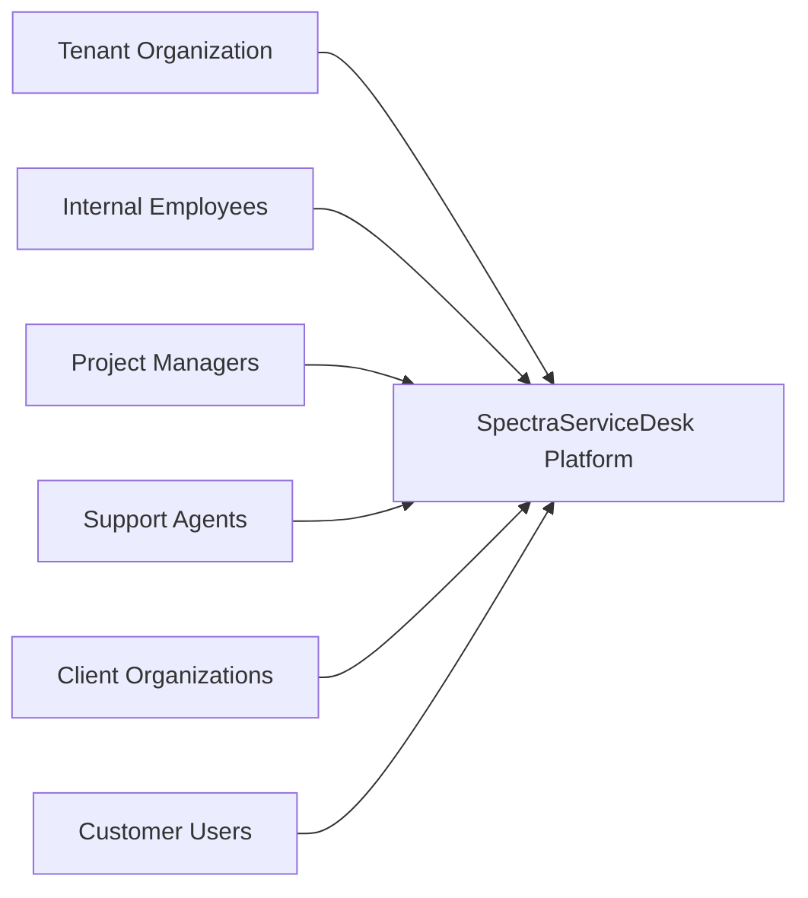

### Technical Blueprint

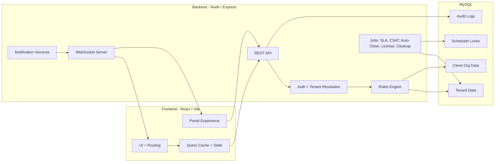

### Business Domain Map

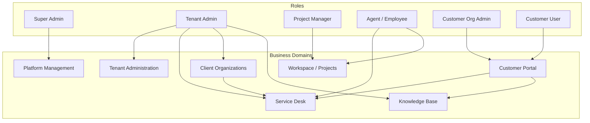

### Tenant and Client Access Model

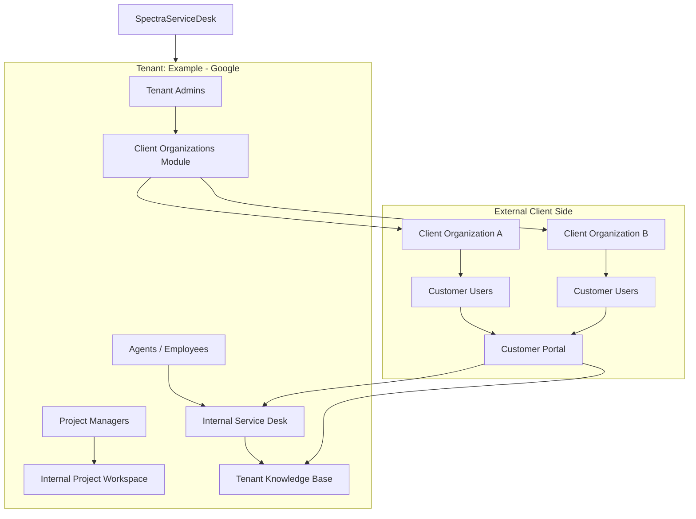

### Authentication & Tenant Resolution Flow

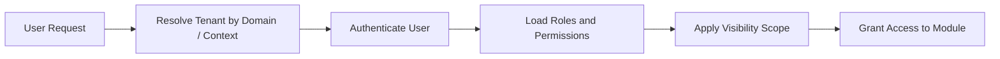

### Internal vs External Ticket Sources

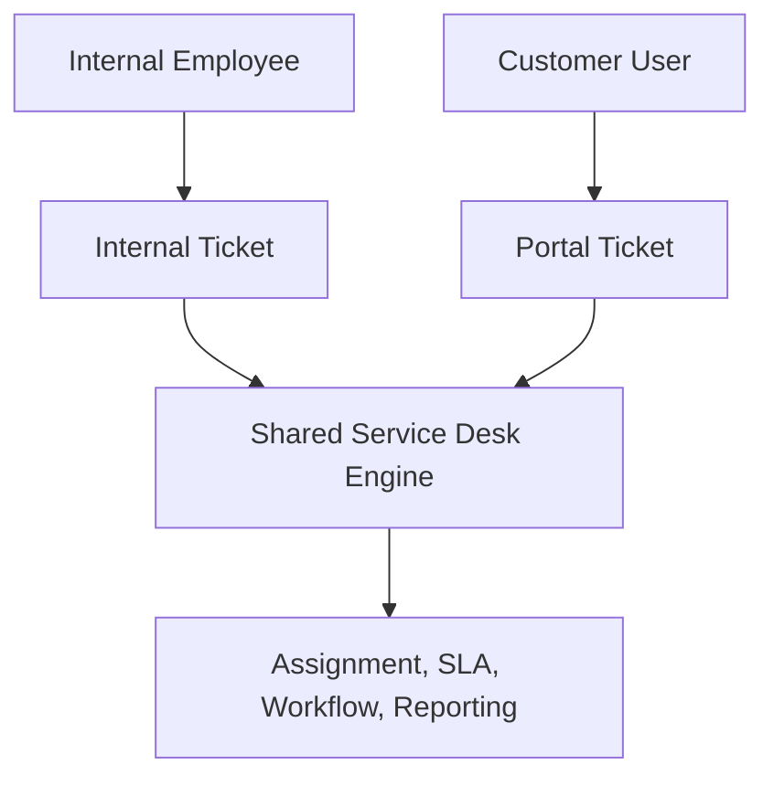

### Ticketing Automation Flow

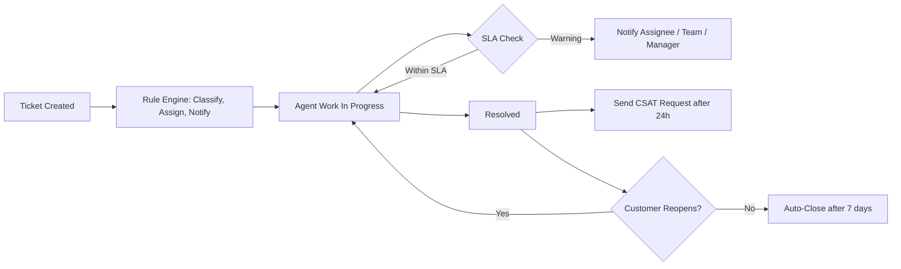

### External Support Lifecycle

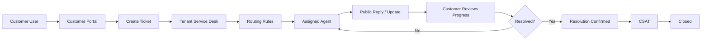

### SLA Escalation Flow

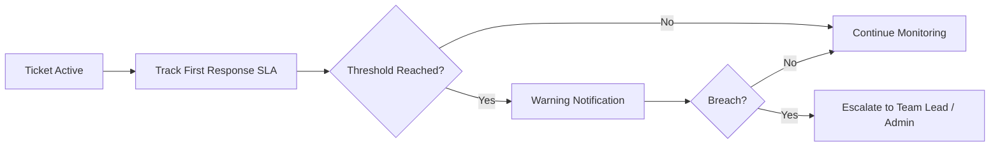

### Project Delivery Flow

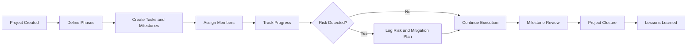

### Knowledge Deflection Flow

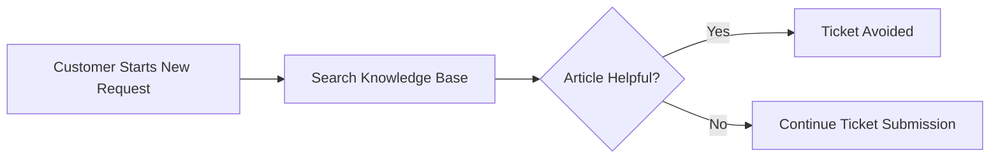

### Notification Flow

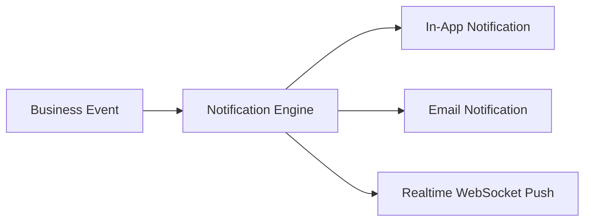

### Visibility Boundary Model

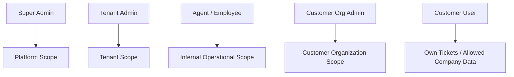

---

## 📂 Project Structure

```bash
SpectraServiceDesk/
├── src/                         # Frontend React application
├── public/                      # Static assets
├── backend/                     # Backend API and services
│   ├── routes/                  # API domains
│   │   ├── admin/
│   │   ├── auth/
│   │   ├── customers/
│   │   ├── knowledge-base/
│   │   ├── projects/
│   │   ├── service-catalog/
│   │   ├── tickets/
│   │   └── tenant/
│   ├── services/                # Business logic
│   │   ├── audit/
│   │   ├── email/
│   │   ├── notifications/
│   │   ├── rules/
│   │   ├── sla/
│   │   └── tenant/
│   ├── middleware/              # Auth, RBAC, tenant resolution
│   ├── migrations/              # SQL migrations
│   ├── jobs/                    # Scheduled jobs
│   ├── uploads/                 # Local file storage
│   └── websocket/               # Realtime gateway
```

---

## ⚙️ Installation & Setup

### Requirements

* Node.js 18+
* MySQL 8.x

---

## 📄 License

Distributed under the Proprietary License. See `LICENSE` for more information.

---

<p align="center">
  **Built with ❤️ by the SpectraEYE Team**
</p>
